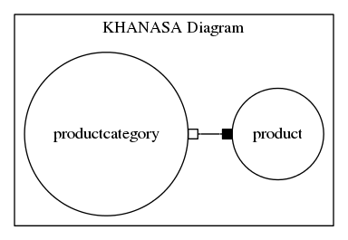

Khanasa diagram creator via GraphViz Java API
=============================================

**Purpose :** Create KHANASA diagram from database schema.

What is KHANASA diagram?
------------------------

**eg:diagram attributes :**

* Table 1 : **productcategory** [id , categoryname]

* Table 2 : **product** [id, productname, productcategory_id]

How to use this project
-----------------------

* **1).** Install Graphviz version 2.36.0 or higher, to check version : **"dot -V"**

* **2).** Clone this project. And I assume that you have database, tables and schema in your local.

* **3).** Connect to the database by running the program with some parameters via port "localhost:4567" then it will provides Khanasa diagram.

**Input parameters :**

* database type : eg(mysql, posgresql)

* ip address : ip address or "localhost"

* [port] : database port[functional]

* database name : database username

* password : database password

References
----------

`http://www.graphviz.org <http://www.graphviz.org>`_
`GraphViz Java API Loria <http://www.loria.fr/~szathmar/off/projects/java/GraphVizAPI/index.php>`_

Author
------

Orathai Khanasa, orathai.khanasa@gmail.com