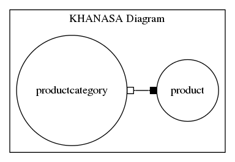

Khanasa diagram creator via org.dynamicus.khanasa.GraphViz Java API
===================================================================

Purpose : To generate  Khanasa diagram from database schema.

First, Install Graphviz version 2.36.0 or higher, to check version : "dot -V"
And I assume that you have database, tables and schema.

eg:
diagram attributes :
Table 1 : **productcategory** [id , categoryname]
Table 2 : **product** [id, productname, productcategory_id]

Second, connect to the database by running the program with some parameters via port "localhost:4567"
 then it will provides Khanasa diagram.

Input parameters : database type, ip address, [port], database name, password

References
----------

`http://www.graphviz.org <http://www.graphviz.org>`_
`org.dynamicus.khanasa.GraphViz Java API Loria <http://www.loria.fr/~szathmar/off/projects/java/GraphVizAPI/index.php>`_

Author
------

Orathai Khanasa, orathai.khanasa@gmail.com